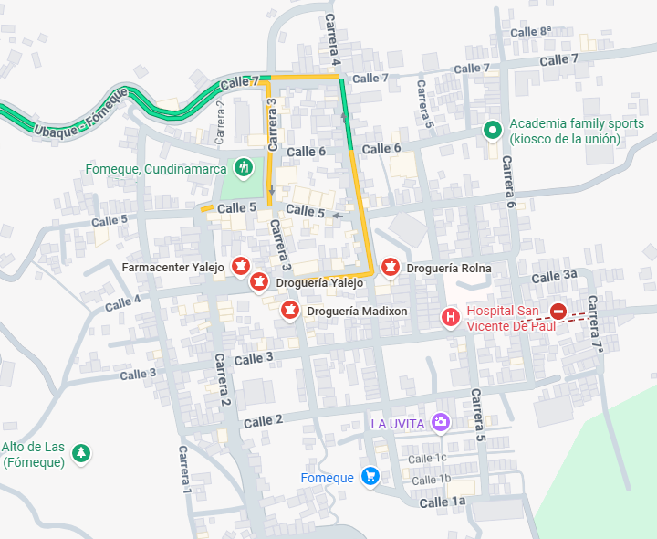
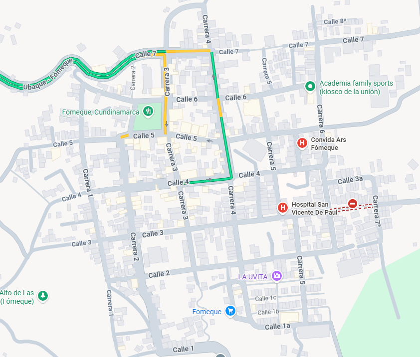
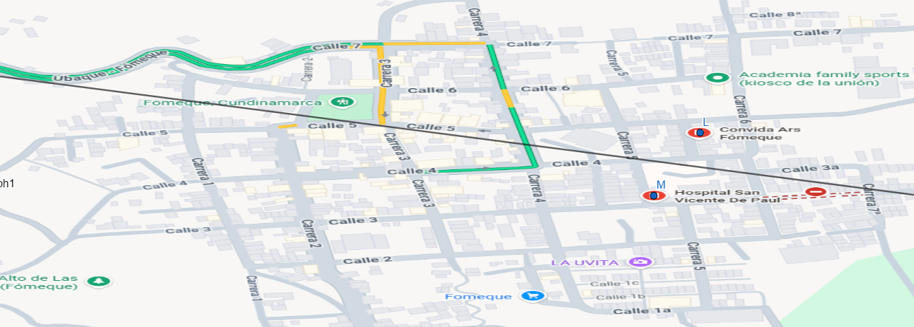
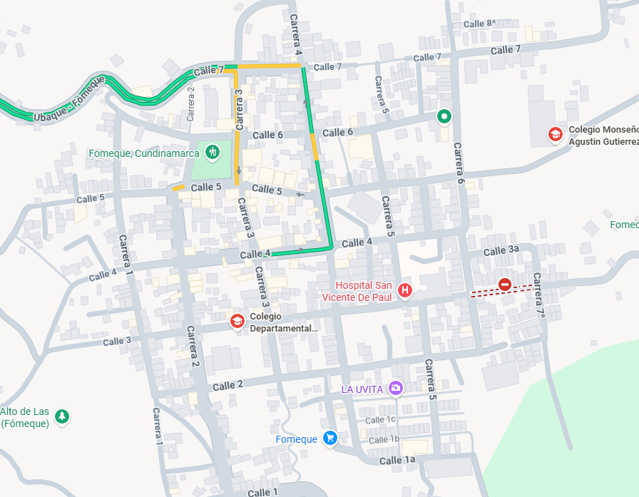
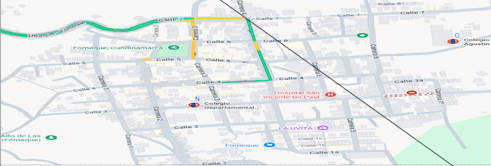

# Análisis de Diagramas de Voronoi – Fómeque

## Introducción

En este documento se realiza un análisis espacial utilizando diagramas de Voronoi aplicados a tres tipos de servicios en el municipio de Fómeque:

- Droguerías  
- Hospitales  
- Colegios  

El diagrama de Voronoi divide el espacio en regiones donde cada punto pertenece al servicio más cercano. Esto permite evaluar cobertura, centralización y posibles necesidades de expansión.

---

# 1. Análisis de Droguerías

## Diagrama de Voronoi – Droguerías

## Observaciones

- Las droguerías están concentradas en el centro urbano, principalmente en el occidente.
- Se observan regiones de Voronoi amplias en sectores periféricos.
- Existe sobreconcentración en el eje central del municipio.

## Interpretación

En un diagrama de Voronoi:

- Regiones grandes → menor cobertura espacial.
- Regiones pequeñas → mayor densidad de servicio.

El diagrama muestra:
- Alta competencia en el centro.
- Baja cobertura en sectores oriental y suroccidental.

## Conclusión

Podría faltar una droguería en:
- Zona oriental.

---

# 2. Análisis de Hospitales

## Diagrama de Voronoi – Hospitales

## Observaciones

- Solo existen dos hospitales.
- Ambos se encuentran ubicados en la zona oriental del municipio.

## Interpretación

- Mayor distancia promedio en zonas periféricas.

## Conclusión

Desde el punto de vista espacial, sería recomendable considerar un nuevo centro de atención básica en sectores periféricos occidentales para mejorar cobertura y tiempos de respuesta.

---

# 3. Análisis de Colegios

## Diagrama de Voronoi – Colegios

## Observaciones

- Existen al menos dos instituciones educativas.
- Las regiones están más balanceadas que en el caso hospitalario.
- Sectores periféricos presentan regiones más amplias.

## Interpretación

- Cobertura relativamente equilibrada.
- Mejor distribución que hospitales.
- Aún existen zonas con menor proximidad.

## Conclusión

No es una necesidad crítica, pero podría considerarse una institución adicional en zonas periféricas para optimizar la cobertura educativa.

---

# Comparación General

| Servicio     | Distribución            | Cobertura Territorial | Necesidad de Expansión |
|--------------|------------------------|------------------------|------------------------|
| Droguerías  | Concentradas en occidente y centro | Media                  | Moderada               |
| Hospital    | Centralizado en oriente | Baja                   | Alta                   |
| Colegios    | Relativamente balanceado (occidente-oriente) | Media-Alta           | Baja-Moderada          |

* Podría considerarse que en el occidente del municipio hay más droguerias como respuesta a la concentración oriental de los centros de salud.
---
